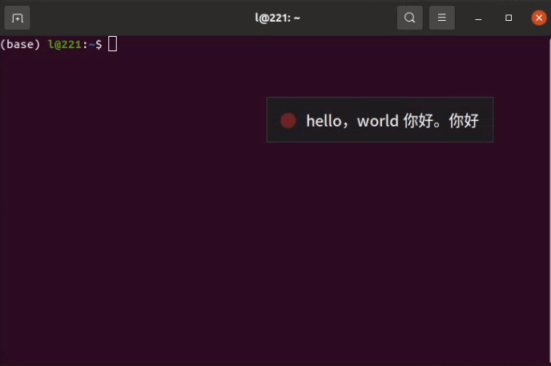
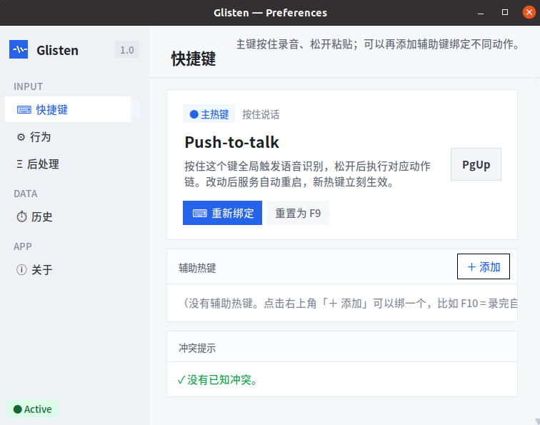
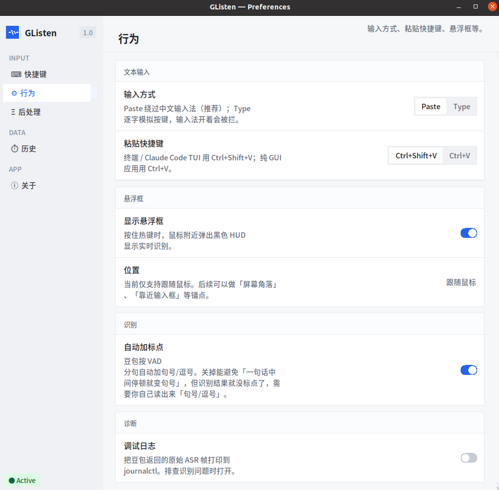
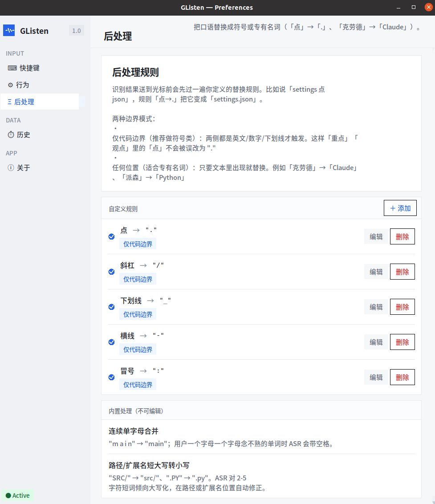
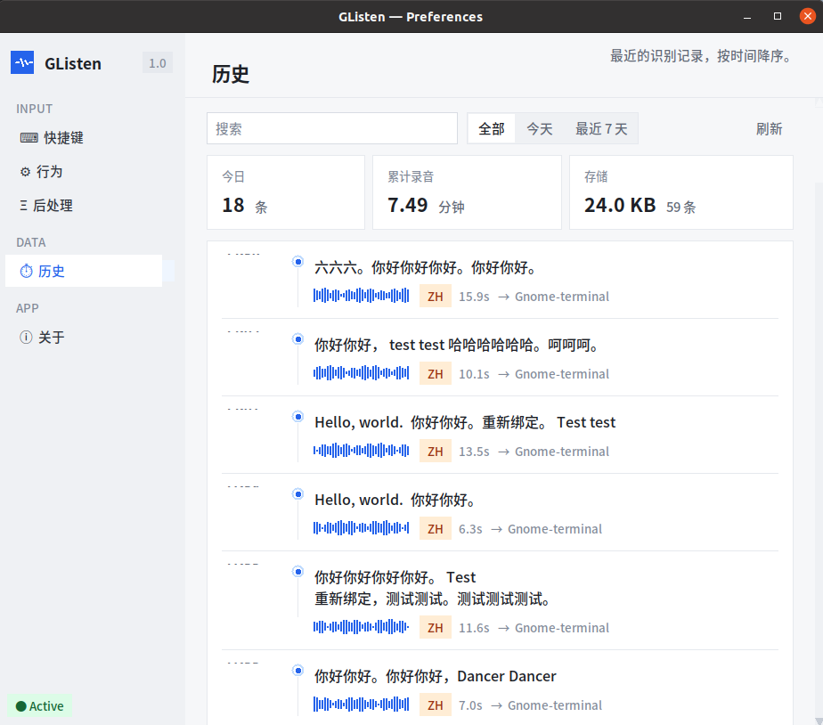
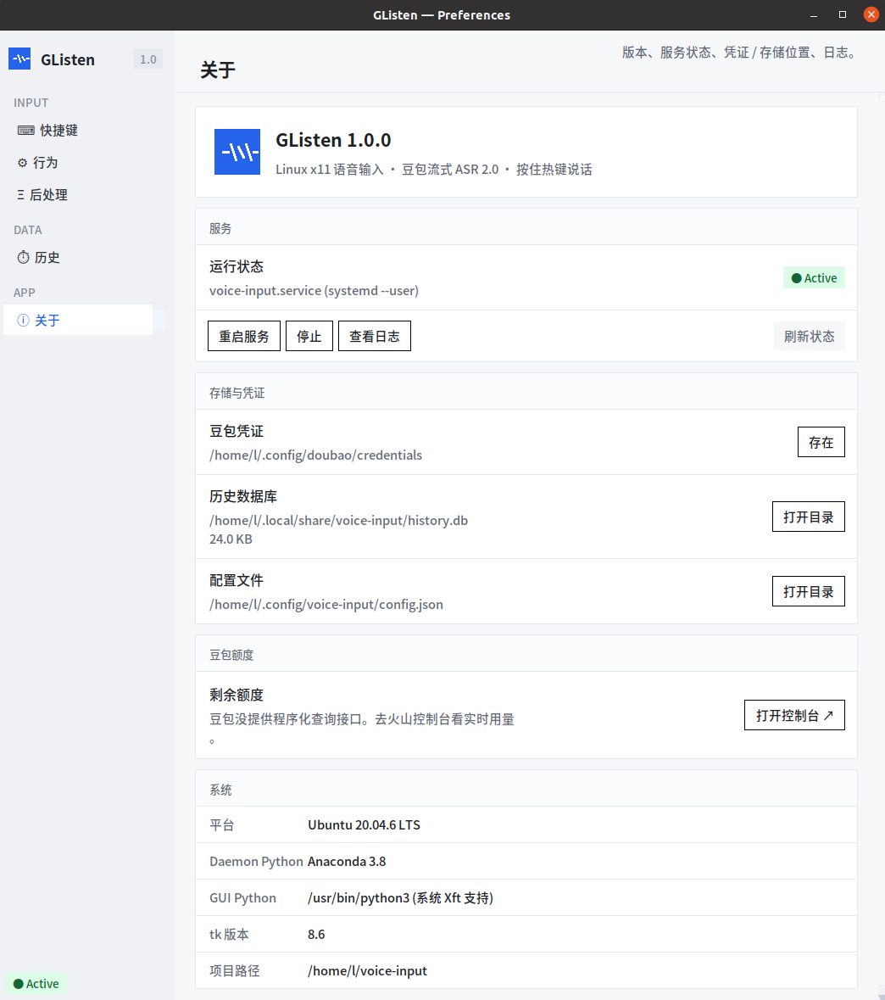

# GListen —— Real-time voice typing for Linux.

**Real-time voice typing for Linux.** Hold a hotkey, speak, release — text is pasted into whatever app you're focused on, with transcription history saved locally. Powered by [Doubao Streaming ASR 2.0](https://www.volcengine.com/docs/6561/163043) (ByteDance, 20 hours free on signup).

[中文版](README.md)

```
Focus on any app → Hold hotkey → Speak → Release → Text pasted into that app
                      ↑ A floating HUD shows live transcription near your mouse
```
<p align="center">
  
</p>

<p align="center">
  
</p>

<p align="center">
  
</p>

<p align="center">
  
</p>

<p align="center">
  
</p>

<p align="center">
  
</p>


## Features

### Hold to speak, release to type

Focus on any window (terminal, browser, editor, chat), hold the hotkey (default F9) and start speaking. A translucent black HUD pops up near your mouse showing the transcription in real time — words appear as you say them, no waiting. When you release the hotkey, the final result is pasted into the focused window (or copied to clipboard if you've configured a hotkey for that — see below).

### Multi-hotkey + action chains

Beyond the default "dictate & paste", you can bind other keys to different action combinations:

- **F9** (default): dictate → paste into focused window
- **F10**: dictate → paste → auto-press Enter (great for chat apps — speak and send in one go)
- **F11**: dictate → copy to clipboard only (paste whenever you're ready)

Add as many hotkeys as you like in the GUI settings.

### Post-processing rules

When coding, you often need to dictate symbols — saying "settings 点 json" (点 = "dot" in Chinese) gets transcribed literally as `settings 点 json`. Post-processing rules automatically replace "点" with `.` when it appears between English words, producing `settings.json`. Built-in rules also cover "斜杠"→`/`, "下划线"→`_`, etc.

You can add custom rules in the GUI, e.g. replacing Chinese phonetic renderings of English terms with their proper spelling. Rules come in two modes: **between English words only** (won't turn "重点" into "重.") and **anywhere** (for proper nouns).

### GUI settings center

Run `glisten config` to open the settings window with 5 pages:

- **Shortcuts**: rebind the primary hotkey; add/edit/delete auxiliary hotkeys
- **Behavior**: input mode (clipboard paste / keystroke simulation), paste key, overlay toggle, auto-punctuation toggle
- **Post-process**: manage replacement rules, toggle each individually
- **History**: timeline view of all transcriptions, search and filter by date
- **About**: service status, restart/stop/logs, credential and database paths

Changes take effect immediately (config is saved → service restarts automatically, ~1-2 second interruption).

### Transcription history

Every voice input is automatically saved to a local SQLite database — text, duration, target window, etc. Browse via CLI (`glisten history`) or the GUI history page. Search, filter, copy, or delete entries.

### System service

After installation, GListen registers as a systemd user service that starts automatically on login. If the process crashes, it restarts on its own. Logs are available via `journalctl --user -u glisten`.

## Quick Start

### Requirements

- **Ubuntu / Debian** (apt-based) with **x11 desktop session**
- System packages: `xdotool` `xclip` `x11-utils` `alsa-utils` `python3-tk` `python3-venv` `fonts-noto-cjk`
- Python 3.8+ (system) + Python 3.10+ (venv, for websockets/pynput)
- **Doubao ASR 2.0 credentials** — sign up at [Volcengine Console](https://console.volcengine.com/speech/app), enable "Doubao Streaming ASR Model 2.0", and grab your APP_ID + Access Token

> **X11 vs Wayland**: GListen uses standard x11 tools (pynput for global hotkey listening, xdotool for text injection, xclip for clipboard). Ubuntu 22.04 and earlier default to x11 — no extra setup needed. Ubuntu 24.04+ defaults to Wayland, where these tools don't work because Wayland's security model blocks apps from listening to other windows' keyboard events or injecting text. If your system is 24.04+, select "Ubuntu on Xorg" from the gear icon on the login screen (the screen where you type your password).

### Installation

```bash
git clone https://github.com/zhaozilong2zl/glisten.git
cd glisten
bash setup.sh
```

`setup.sh` does 5 things:

1. Checks for x11 + apt + systemd
2. Checks system dependencies — **won't auto-install**; prints `sudo apt install ...` for you to run
3. Creates a Python venv and installs `websockets<16` + `pynput`
4. Interactively asks for Doubao credentials (APP_ID / Access Token / Resource ID) → saves to `~/.config/doubao/credentials` with mode 600
5. Registers and starts the systemd --user service

After setup, **hold the hotkey (default F9) and speak**. Release, and the transcription is pasted into your focused app.

## Usage

### Daily use

No manual steps needed — the service runs in the background after login. Hold the hotkey, speak, release.

### CLI

```bash
glisten history              # last 20 transcriptions
glisten history -s keyword   # search
glisten history --today      # today only
glisten stats                # count / recording minutes / DB size
glisten config               # open GUI settings
```

### GUI settings (`glisten config`)

| Page | What you can do |
|---|---|
| **Shortcuts** | Rebind primary hotkey (press-to-capture); add auxiliary hotkeys with action chains (e.g. F10 = paste + Enter) |
| **Behavior** | Input mode (paste / type), paste key (Ctrl+Shift+V / Ctrl+V), overlay toggle, auto-punctuation toggle |
| **Post-process** | Add/edit/delete replacement rules with per-rule toggle |
| **History** | Timeline view with waveforms, search, filter (all / today / last 7 days), copy / delete |
| **About** | Service status, restart / stop / view logs, credential & DB paths, Volcengine console link |

Changes take effect immediately (writes config → auto-restarts service, ~1-2 second interruption).

### Service management

```bash
systemctl --user status glisten
systemctl --user restart glisten
journalctl --user -u glisten -f       # live logs
```

## Background

Most voice typing software is built for Windows and macOS only — [Wispr Flow](https://wisprflow.com/), [Superwhisper](https://superwhisper.com/), [Typeless](https://www.typeless.com/), [闪电说](https://shandianshuo.cn/) and others thrive on those platforms, but as of May 2026 none of them support Linux. This is likely because macOS and Windows each provide a unified system-level input API — build once, works everywhere. Linux desktops are fragmented across display protocols (X11 / Wayland), desktop environments (GNOME / KDE / i3 …), and have a tiny user base, making the cost of adaptation disproportionately high for commercial products.

Linux isn't entirely without options, but each has its limitations:

- [Claude Code](https://code.claude.com/) / [Codex](https://openai.com/) and other AI tools have built-in voice input (though Claude Code's Chinese support is very limited), but it **only works inside their own CLI or app** — you can't dictate into a browser, editor, or chat window
- [Voxtype](https://github.com/peteonrails/voxtype), [nerd-dictation](https://github.com/ideasman42/nerd-dictation) and other open-source projects use local models (Whisper / VOSK), but smaller local models struggle with Chinese-English mixed phrases (larger models are more accurate but need a decent GPU and are slow — the same dilemma as running LLMs locally); plus these tools all work in a **record-then-transcribe** fashion, with no real-time streaming
- GNOME and KDE still don't have built-in voice input as of 2026

So I spent some time (and tokens) building this little tool. It uses Doubao's cloud model for recognition, which handles Chinese-English mixed text noticeably better than local Whisper small models, and it streams in real time — you see words as you speak them, not after you stop.

In the age of vibe coding, building a tool like this isn't particularly hard. I'm just sharing the fruit of my tokens here. If it happens to save someone with similar needs — or an agent searching the web — some tokens they'd spend reinventing the wheel, that'd be great.

## Comparison with alternatives

| Tool | Platform | ASR backend | Chinese | Real-time streaming | Multi-hotkey | GUI |
|---|---|---|---|---|---|---|
| **GListen** | **Linux (x11)** | Doubao 2.0 (cloud) | Yes | Yes | Yes | Yes |
| [Typeless](https://www.typeless.com/) | macOS/Win/iOS/Android | Cloud AI | Yes | Yes | No | Yes |
| [闪电说](https://shandianshuo.cn/) | macOS/Win | Local + optional LLM API | Yes | Yes | No | Yes |
| [Wispr Flow](https://wisprflow.com/) | macOS/Win/iOS/Android | Cloud (proprietary) | Yes | Yes | No | Yes |
| [Superwhisper](https://superwhisper.com/) | macOS/Win/iOS | Whisper local + cloud | Yes | No | No | Yes |
| [Koe](https://github.com/missuo/koe) | macOS only | Doubao 2.0 (cloud) | Yes | Yes | No | No |
| [Voxtype](https://github.com/peteonrails/voxtype) | Linux (Wayland-first) | Whisper local | Yes | No | No | No |
| [Speed of Sound](https://github.com/zugaldia/speedofsound) | Linux (Flatpak) | Whisper + optional LLM | Yes | No | No | Yes |
| [nerd-dictation](https://github.com/ideasman42/nerd-dictation) | Linux | VOSK local | Weak | No | No | No |
| [Talon Voice](https://talonvoice.com/) | macOS/Win/Linux | Conformer local | English-focused | Yes | Yes | No |
| macOS Dictation | macOS | Apple on-device | Yes | Yes | System key | System |
| Windows Voice Typing | Windows 11 | Azure cloud | Yes | Yes | Win+H | System |

GListen requires internet + a Volcengine account (you could DIY it with a local model or adapt to other APIs).

## How it works

The process has three stages:

**While holding the hotkey**: Recording starts (arecord captures 16kHz PCM audio), and audio is streamed to Doubao ASR 2.0 via WebSocket in real time. Doubao returns partial results as it processes each audio chunk. The client-side Transcript Aggregator stitches partial results into complete text (Doubao resets `result.text` on each VAD sentence break, so the client must accumulate across segments). The floating HUD displays the accumulated text in real time.

**When you release the hotkey**: Recording stops and an end-of-stream frame is sent. Doubao performs a final recognition pass (if `enable_nonstream` two-pass recognition is on, it re-evaluates with a larger model), then returns the final result.

**After recognition completes**: Post-processing rules are applied (e.g. "点"→"."), then the configured action chain executes: copy to clipboard → simulate paste keystroke → press additional keys (e.g. Enter) if configured.

```
Hold hotkey
  ├→ Record audio, stream to Doubao via WebSocket
  ├→ Doubao returns partial results, HUD displays in real time
  │
Release hotkey
  ├→ Stop recording, wait for final result
  ├→ Post-process ("点"→".")
  └→ Paste into target window
```

## Config format

`~/.config/glisten/config.json`:

```jsonc
{
  "hotkeys": {
    "main": { "key": "f9", "label": "Dictate", "actions": ["paste"] },
    "auxiliary": [
      { "key": "f10", "label": "Dictate & Send", "actions": ["paste", "press:Return"] }
    ]
  },
  "behavior": {
    "input_mode": "paste",          // paste (clipboard) | type (keystroke simulation)
    "paste_key": "ctrl+shift+v",    // terminal-friendly default
    "overlay_enabled": true,
    "auto_punctuation": true,       // Doubao enable_punc; turn off to avoid pauses becoming periods
    "debug": false
  },
  "postprocess": {
    "rules": [
      { "pattern": "点", "replacement": ".", "boundary": "word", "enabled": true }
      // boundary: "word" = only between English words ("重点" won't be affected); "always" = replace anywhere
    ]
  }
}
```

## Transferring to a new machine

Want to keep using GListen (with your history) on a new computer? Two steps:

**1. Package on the old machine**

```bash
bash scripts/package.sh
```

This creates a small archive under `/tmp/` (excludes Python environment and credentials). Transfer it via USB drive, cloud storage, `scp`, etc.

**2. Install on the new machine**

```bash
tar xzf glisten-*.tar.gz
cd glisten
bash setup.sh
```

`setup.sh` walks you through installing dependencies, setting up the environment, and entering Doubao credentials — same as a fresh install. Credentials are not included in the archive (for security), so you'll need to grab your APP_ID and Access Token from the [Volcengine Console](https://console.volcengine.com/speech/app) again.

## Uninstall / Reinstall

If you need to uninstall or reinstall, **always stop the old service first** — otherwise you'll end up with two daemon processes fighting over the same hotkey (two HUDs pop up, recognition fails).

```bash
# Uninstall (stops service + removes unit file + removes CLI symlink)
bash scripts/uninstall.sh

# To reinstall, just run setup.sh again after uninstalling
bash setup.sh
```

Uninstalling only stops the service and removes the symlink — it does not delete the Python environment (venv), config (`~/.config/glisten/`), history (`~/.local/share/glisten/`), or Doubao credentials (`~/.config/doubao/`). When you reinstall, `setup.sh` detects these are already in place and skips them.

## Project structure

| File | Role |
|---|---|
| `voice_daemon.py` | Main daemon: hotkey listener + Doubao WS + action chain + history recording |
| `overlay_gui.py` | Floating HUD subprocess (system python3 for Xft/CJK font rendering) |
| `glisten_gui/` | GListen Settings GUI (tkinter, 5 pages) |
| `config.py` | JSON config load/save with schema + defaults + atomic write |
| `keys.py` | Key name conversion: config string ↔ pynput Key ↔ tkinter keysym |
| `history.py` | SQLite history module |
| `cli.py` | CLI entry point, symlinked as `~/.local/bin/glisten` |
| `setup.sh` | One-command bootstrap for new machines |
| `scripts/` | systemd unit template, install/uninstall/package scripts |

## Acknowledgments

- **[missuo/koe](https://github.com/missuo/koe)** (MIT) — TranscriptAggregator logic (interim/definite/final accumulation, longest-overlap deduplication) ported from its Rust implementation in `koe-asr/src/transcript.rs`
- **[zhouruhui/volcengine-asr-ha](https://github.com/zhouruhui/volcengine-asr-ha)** (MIT) — WebSocket binary frame protocol (pack/parse) referenced from its Python implementation

## Contact
2507844603@qq.com

## License

This project is licensed under the terms of the MIT license.
